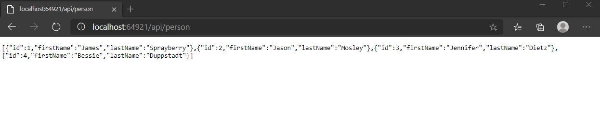
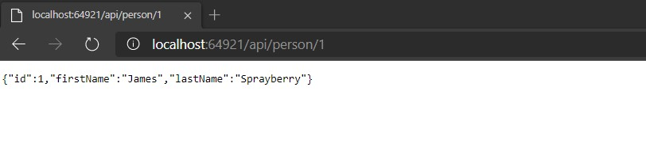
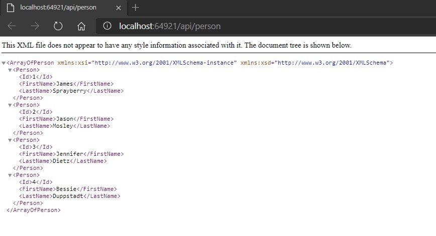

# Tareas del MOC

## Module 13: Implementing Web APIs

# Lesson 2: Developing a Web API

### Demonstration: How to Develop a Web API

- Cambiamos la ruta por defecto en el **launchSettings.json**

- Creamos un controlador **PersonController**

  - Le añadimos el constructor que añade 4 personas
  - Añadimos la accion **GetAll** y **GetPersonById**

- Ejecutamos y comprobamos que nos devuelve un json con las personas

  

  

  

- Si le pasamos el id 1 nos devuelve solo una persona

  

  

  

- Añadimos el paquete **Microsoft.AspNetCore.Mvc.Formatters.Xml**  y en el middleware registramos el formateador XML **AddXmlSerializerFormatters**

- En el controlador **PersonController** etiquetamos la accion **GetAll** para que devuelva un XML

- Ejecutamos y comprobamos la salida

